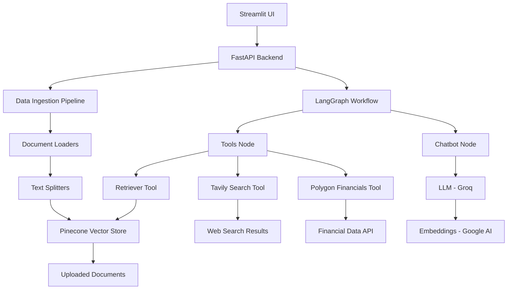

# Agentic Trading Bot Project Overview

## Problem Statement / Use Case
This project implements an **agentic trading bot** designed to assist users with stock market-related queries. The bot leverages a combination of document-based knowledge retrieval (RAG), real-time web search, and financial data APIs to provide intelligent responses to questions about stock markets, trading basics, company financials, and investment strategies.

Key features:
- Upload and process stock market documents (PDFs, DOCX) to build a knowledge base
- Query the bot for stock market insights, financial data, and general trading advice
- Integrates multiple data sources: uploaded documents, web search (Tavily), and financial APIs (Polygon)
- Uses AI agents powered by LangGraph for conversational interactions

The primary use case is to create an interactive chatbot that can answer complex stock market questions by combining retrieved knowledge from documents with real-time data and web information.

## Architecture Diagram



### Architecture Components:
1. **Frontend**: Streamlit web interface for file uploads and chat interactions
2. **Backend**: FastAPI server handling API requests
3. **Agent Workflow**: LangGraph-based state machine managing conversation flow
4. **Tools**: Specialized tools for data retrieval and processing
5. **Data Storage**: Pinecone vector database for document embeddings
6. **External APIs**: Tavily for web search, Polygon for financial data
7. **AI Models**: Groq LLM for chat, Google AI for embeddings

## Tech Stack

### Core Technologies:
- **Programming Language**: Python 3.10+
- **Backend Framework**: FastAPI
- **Frontend Framework**: Streamlit
- **Agent Framework**: LangGraph
- **LLM Framework**: LangChain

### AI/ML Components:
- **Large Language Model**: Groq (deepseek-r1-distill-llama-70b)
- **Embedding Model**: Google Generative AI (models/text-embedding-004)
- **Vector Database**: Pinecone

### Tools & APIs:
- **Web Search**: Tavily Search API
- **Financial Data**: Polygon API
- **Document Processing**: PyPDFLoader, Docx2txtLoader
- **Text Splitting**: RecursiveCharacterTextSplitter

### Infrastructure & Utilities:
- **Configuration Management**: YAML configuration files
- **Environment Variables**: python-dotenv
- **Logging**: Custom logging with timestamped files
- **Error Handling**: Custom TradingBotException class
- **Package Management**: pip/setuptools (setup.py provided)

### Dependencies (from setup.py):
- lancedb
- langchain
- langgraph
- tavily-python
- polygon

## Deployment Documentation

### Prerequisites
1. Python 3.10 or higher
2. Required API keys:
   - POLYGON_API_KEY
   - GOOGLE_API_KEY
   - TAVILY_API_KEY
   - GROQ_API_KEY
   - PINECONE_API_KEY

### Environment Setup
1. Create conda environment:
   ```bash
   conda create -p env python=3.10 -y
   conda activate ./env
   ```

2. Install dependencies:
   ```bash
   pip install -r requirements.txt
   ```
   Or install the package:
   ```bash
   pip install -e .
   ```

3. Set up environment variables in `.env` file:
   ```
   POLYGON_API_KEY=your_polygon_key
   GOOGLE_API_KEY=your_google_key
   TAVILY_API_KEY=your_tavily_key
   GROQ_API_KEY=your_groq_key
   PINECONE_API_KEY=your_pinecone_key
   ```

### Running the Application

#### Option 1: FastAPI Backend + Streamlit UI
1. Start the FastAPI server:
   ```bash
   uvicorn main:app --host 0.0.0.0 --port 8000 --reload
   ```

2. In a separate terminal, start the Streamlit UI:
   ```bash
   streamlit run streamlit_ui.py
   ```

#### Option 2: Standalone Streamlit App
Run the Streamlit app directly (includes backend integration):
```bash
streamlit run streamlit_ui.py
```

### Configuration
- Main configuration is in `config/config.yaml`
- Vector DB index name: "trading-bot"
- Embedding dimensions: 768 (for Google embeddings)
- Retriever settings: top_k=3, score_threshold=0.5

### File Structure
```
agentic-trading-bot/
├── main.py                 # FastAPI application
├── streamlit_ui.py         # Streamlit frontend
├── setup.py               # Package setup
├── Pipfile                # Pipenv dependencies (empty)
├── README.md              # Basic instructions
├── archive.py             # Older Streamlit version
├── agent/
│   ├── workflow.py        # LangGraph workflow definition
│   └── __init__.py
├── config/
│   └── config.yaml        # Application configuration
├── custom_logging/
│   ├── my_logger.py       # Custom logging setup
│   └── __init__.py
├── data_ingestion/
│   ├── ingestion_pipeline.py  # Document processing pipeline
│   └── __init__.py
├── data_models/
│   ├── models.py          # Pydantic models
│   └── __init__.py
├── exception/
│   ├── exceptions.py      # Custom exceptions
│   └── __init__.py
├── fallback_data/         # Sample documents
├── notebook/
│   ├── experiments.ipynb  # Jupyter experiments
│   └── logs/
├── prompt_library/        # (Empty)
├── toolkit/
│   ├── tools.py           # LangChain tools
│   └── __init__.py
└── utils/
    ├── config_loader.py   # YAML config loader
    ├── model_loaders.py  # AI model loaders
    └── __init__.py
```

### API Endpoints
- `POST /upload`: Upload and process documents
- `POST /query`: Query the chatbot

### Logging
- Logs are stored in `logs/` directory with timestamped filenames
- Format: `[timestamp] line_number logger_name - level - message`

### Error Handling
- Custom `TradingBotException` provides detailed error information
- Includes file name, line number, and error message

### Future Improvements (from README)
- Implement comprehensive logging and exception capture
- Test LangGraph workflow in Jupyter notebook
- Deploy the application
- Add real-time data fetching tool validation</content>
<parameter name="filePath">d:\AI_PROJECTS\agentic-trading-bot-project\agentic-trading-bot_V0\project_overview.md